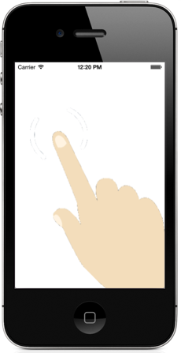

# Touchposé


Touchposé is a set of classes for iOS that renders screen touches when
a device is connected to a mirrored display. Touchposé adds a
transparent overlay to your app’s UI; all touch events cause
semi-transparent circles to be rendered on the overlay--an essential
tool when demoing an app with a projector (with an iPad 2 or iPhone
4S).

To use Touchposé in your own app, copy `QTouchposeApplication.m` and
`QTouchposeApplication.h` from the example project to your project.

Touchposé should work for most apps (but read the caveat below). It’s
implemented by a single public class, `QTouchposeApplication`, and
several private classes.  `QTouchposeApplication` overrides
`‑sendEvent:` and is responsible for rendering touches on the overlay
view.  There are some gnarly implementation bits to ensure that the
overlay view remains the top-most view in the view hierarchy. This is
achieved by intercepting calls to `-didAddSubview:` and
`-becomeKeyWindow` using _method swizzling_. Method swizzling is
supported by the Objective-C runtime, but it’s usually considered a
dangerous practice, especially when done on classes you don’t
own. Furthermore, it only works if you’re the only one swizzling—if
some other class is also swizzling methods on the same class, things
may go amok. My recommendation is to only use this code in private
builds when you want to demo your app to an audience on a projector.

To use Touchposé with an app, indicate that `QTouchposeApplication`
should be used instead of `UIApplication`. This is done by specifying
the application class in UIApplicationMain:

        int main(int argc, char *argv[])
        {
            @autoreleasepool
            {
                return UIApplicationMain(argc, argv,
                                         NSStringFromClass([QTouchposeApplication class]),
                                         NSStringFromClass([QAppDelegate class]));
            }
        }

That’s it; no other steps are needed. By default, touch events are
only displayed when actually connected to an external device. If you
want to always show touch events, set the `alwaysShowTouches` property
of `QTouchposeApplication` to `YES`.

## Swift
(tested on Xcode 6.3.1)

Remove `@UIApplicationMain` from your AppDelegate file.

After adding Touchpose to your project you will need a main.swift file that has 1, yes 1, line in it:

        UIApplicationMain(Process.argc, Process.unsafeArgv, NSStringFromClass(QTouchposeApplication.self), NSStringFromClass(YOUR_APP_Delegate.self))

Or change the name of the sampleMain.swift file and add it to your project

## Custom Cursor Indicators

Instead of the default "bubble" indicator, you can supply your own image after you instantiate `QTouchposeApplication`.

For example, you can use the following [hand cursor image](./QTouchposeFinger.png) to generate a custom cursor.


```
touchposeApplication.customTouchImage = [UIImage imageNamed:@"<my_custom_image.png>"];
touchposeApplication.customTouchPoint = CGPointMake(214, 148);
```

The `customTouchPoint` property is the desired touch point of your image, relative to the image itself (upper-left corner = 0,0). In this case, the point *214,148* represents the tip of the index finger in the image.

After adding these two properties, your cursor will now be represented by the custom image.




## Known Issues

- When an alert view is display, touches that are initiated outside
  the alert view aren’t displayed. Touches inside the alert view are
  displayed correctly (even if moved outside the alert view).

- It seems that in iOS versions earlier than 5, Touchposé interferes
  with the performance of the on-screen keyboard. As a workaround,
  Touchposé is automatically disabled when the keyboard is shown if
  running a version earlier than iOS 5. Note that touches are never
  displayed on the keyboard, even on iOS 5. This isn’t too
  significant, because the keyboard already has a visual effect
  indicating where touches occur.

- The finger touch views are not always removed when a touch
  ends. This appears to be caused by a bug in iOS: we don't get
  notified of all `UITouch` instances ending. See
  [here](https://discussions.apple.com/thread/1507669?start=0&tstart=0)
  for a discussion of this issue. I haven't investigated this issue
  extensively—it seems to only occur on versions of iOS prior to 5.

## License

Touchposé is licensed under the
[Apache License, Version 2.0](http://www.apache.org/licenses/LICENSE-2.0.html).
