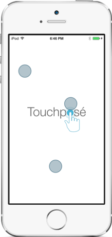
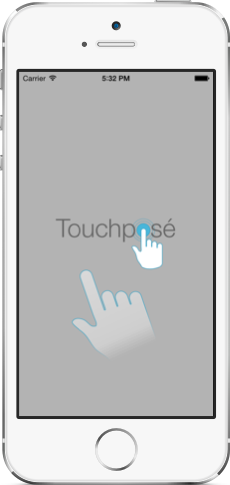

# Touchposé



Touchposé is a library for iOS that renders screen touches. Touchposé
adds a transparent overlay to your app’s UI; all touch events cause
semi-transparent circles to be rendered on the overlay--an essential
tool when demoing an app with a projector or creating a demo video. By
default, touches are only rendered when connected to a mirrored
screen, but this be overridden.

Before deciding to using Touchposé, see the Caveats section below.

To use Touchposé with an app, indicate that `TRTouchposeApplication`
should be used instead of `UIApplication`. This is done by specifying
the application class in `UIApplicationMain()`:

```objc
int main(int argc, char *argv[])
{
    @autoreleasepool
    {
        return UIApplicationMain(argc, argv,
                                 NSStringFromClass([TRTouchposeApplication class]),
                                 NSStringFromClass([MyAppDelegate class]));
    }
}
```

If you’re using Objective-C, that’s it; no other steps are needed. For
Swift 3, keep reading.

## Installation

### CocoaPods

To use Touchposé with [CocoaPods](https://cocoapods.org), add `pod
'Touchpose', '~> 2.0'` to you `Podfile`. For example:

```ruby
source 'https://github.com/CocoaPods/Specs.git'
platform :ios, '8.0'

use_frameworks! # required with Swift, optional with Objective-C

target 'TargetName' do
  pod 'Touchpose', '~> 2.0'
end
```

## Using with Swift 3

Touchposé works with Swift 3, but requires a few additional steps to setup:

- Add `main.swift` to your project with the following content
  (replacing `AppDelegate` with the name of your application delegate
  class):

    ```swift
    import UIKit
    import Touchpose


    UIApplicationMain(CommandLine.argc,
                      UnsafeMutableRawPointer(CommandLine.unsafeArgv).bindMemory(to: UnsafeMutablePointer<Int8>.self, capacity: Int(CommandLine.argc)),
                      NSStringFromClass(TRTouchposeApplication.self),
                      NSStringFromClass(AppDelegate.self))
    ```
    
    (If anyone has a better way of passing `CommandLine.unsafeArgv`, I’d love to know what it is.)

- Remove the `@UIApplicationMain` attribute from your app delegate class.

- If you want to unconditionally enable Touchposé, add the following
  to your `application( :didFinishLaunchingWithOptions)`
  implementation should be something like this:

    ```swift
    func application(_ application: UIApplication, didFinishLaunchingWithOptions launchOptions: [UIApplicationLaunchOptionsKey: Any]?) -> Bool {
        window?.makeKeyAndVisible()
        (application as! TRTouchposeApplication).showTouches = true
        // Override point for customization after application launch.
        return true
    }
    ```

## Custom Touch Indicators

Instead of the default circle touch indicator, you can customize the
view used for touches. To do this set the `touchViewFactory` property
of `TRTouchposeApplication` to a custom factory class that implements
the `TRTouchposeTouchViewFactory` protocol.

Touchposé includes an alternate touch view factory
`TRTouchposeImageTouchViewFactory` that uses an image for the touch
view. This can be configured like this:

```objc
TRTouchposeImageTouchViewFactory *touchViewFactory = [[TRTouchposeImageTouchViewFactory alloc] init];
touchViewFactory.touchImage = [UIImage imageNamed:@"Finger"];
touchViewFactory.offset = CGPointMake(52, 43);
touchposeApplication.touchViewFactory = touchViewFactory;

```

This setup produces a image of a hand with the pointer finger
indicating the touch point. The `offset` property above provides the
offset from the image’s origin (top-right corner) that represents the
touch point.



## Caveats

- Touchposé requires using a custom subclass of `UIApplication`. If
  your app already uses some other custom `UIApplication` subclass,
  you can’t use Touchposé.
- Touchposé uses method swizzling to intercept calls to
  `-didAddSubview:` and `-becomeKeyWindow` on `UIWindow`. Method
  swizzling is supported by the Objective-C runtime, but it’s usually
  considered a dangerous practice, especially when done on classes you
  don’t own. Furthermore, it only works if you’re the only one
  swizzling—if some other class is also swizzling methods on the same
  class, things may go amok.
- Touches are not always displayed in alert views and the keyboard.

My recommendation is to only use Touchposé in private builds when you
want to demo your app to an audience on a projector.

## License

Touchposé is licensed under the
[Apache License, Version 2.0](http://www.apache.org/licenses/LICENSE-2.0.html).

## Credits

The devices images in this README are from
[Robbie Pearce](http://robbiepearce.com/devices).
